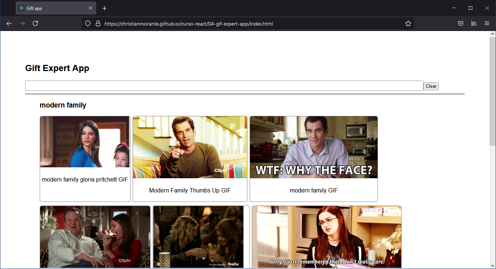

# React Course Repository ⚛
All applications developed during the course

🔎 Explore [here at Github Pages](https://christianmorante.github.io/curso-react/)

### Gif Expert App 🚀
React web application with components to render gifs from [Giphy](https://giphy.com/)
